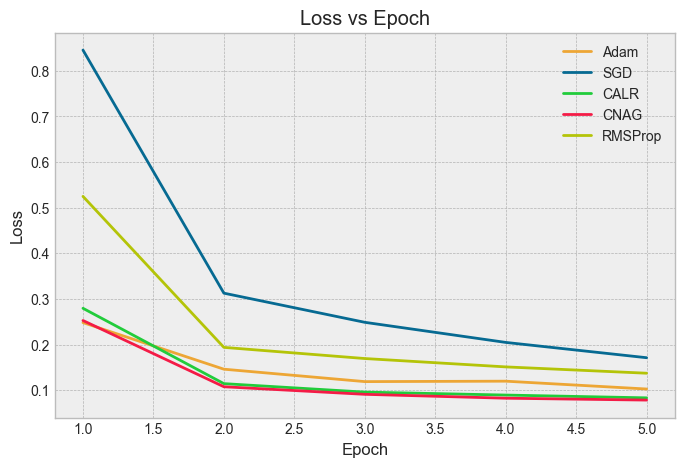
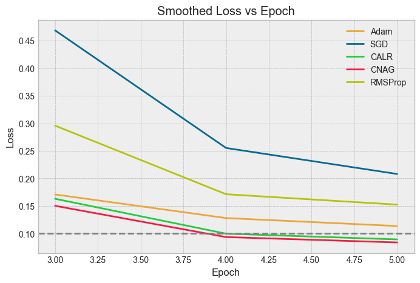
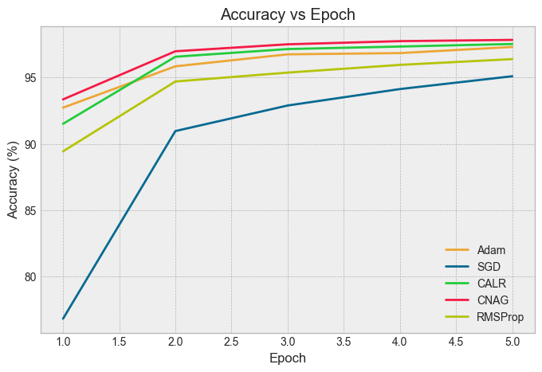
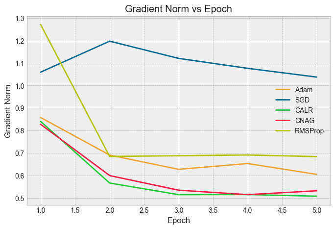
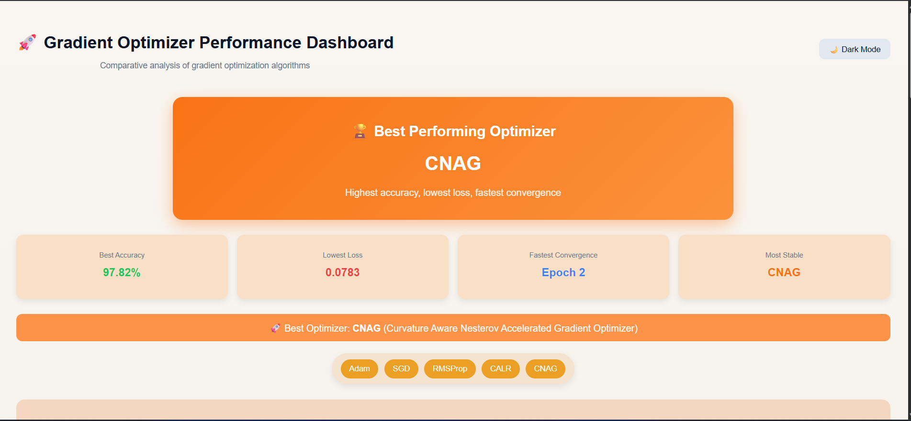
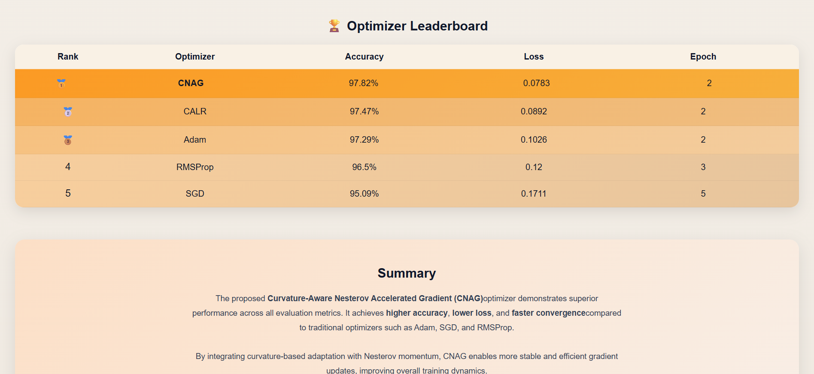

# 🚀 Curvature-Aware Nesterov Adaptive Optimizer (CALR-NAG)

> A curvature-aware optimization framework that integrates **adaptive moment estimation, curvature scaling, and Nesterov acceleration** to enable efficient training of deep neural networks in complex non-convex loss landscapes.

---

## 📌 Abstract

Optimization lies at the core of deep learning, directly influencing convergence speed, stability, and generalization. However, modern neural networks exhibit highly **non-convex loss landscapes** characterized by saddle points, flat plateaus, and anisotropic curvature.

Traditional optimizers such as **Stochastic Gradient Descent (SGD)**, **Adam**, and **RMSProp** rely primarily on first-order gradient information. While effective in many scenarios, these methods lack explicit awareness of curvature, leading to:

- Slow convergence in flat regions  
- Oscillations in sharp curvature zones  
- Suboptimal generalization  

To address these limitations, this project proposes **CALR-NAG (Curvature-Aware Nesterov Adaptive Optimizer)**, a novel optimization strategy that:

- Incorporates **curvature-aware learning rate scaling**  
- Utilizes **Nesterov look-ahead gradient estimation**  
- Maintains **adaptive moment estimates** for stability  

By approximating curvature using gradient magnitude, CALR-NAG achieves **second-order-like behavior without explicit Hessian computation**, ensuring both efficiency and scalability.

Extensive experiments on **MNIST (MLP)** and **CIFAR-10 (CNN)** demonstrate:

- ⚡ Faster convergence  
- 📉 Lower final loss  
- 📈 Higher accuracy  
- 🔒 Improved stability  

---

## 🧠 Core Idea

The key intuition behind CALR-NAG is:

> *"Use gradient statistics to estimate curvature and adapt learning rates dynamically, while predicting future gradients using Nesterov acceleration."*

This enables:
- Efficient navigation through **saddle points**
- Reduced oscillations in **high-curvature regions**
- Faster movement across **flat plateaus**

---

## 🧮 Mathematical Formulation

### 🔹 Problem Definition

We aim to minimize a loss function:

$$
\min_{\theta} \; L(\theta)
$$

where:
- $\theta$ → model parameters  
- $L(\theta)$ → loss function  

---

### 🔹 Gradient

$$
g_t = \nabla L(\theta_t)
$$

---

### 🔹 First Moment (Momentum)

$$
m_t = \beta_1 m_{t-1} + (1 - \beta_1) g_t
$$

---

### 🔹 Second Moment (Variance)

$$
v_t = \beta_2 v_{t-1} + (1 - \beta_2) g_t^2
$$

---

### 🔹 Bias Correction

$$
\hat{m}_t = \frac{m_t}{1 - \beta_1^t}
$$

$$
\hat{v}_t = \frac{v_t}{1 - \beta_2^t}
$$

---

### 🔹 Curvature Approximation

Instead of computing the Hessian $H$, we approximate curvature using gradient magnitude:

$$
H_t = |\nabla L(\theta_t)| + \delta
$$

where:
- $\delta$ → small constant for numerical stability  

---

### 🔹 Curvature-Aware Learning Rate

$$
\eta_t = \frac{\eta}{\sqrt{\hat{v}_t + \alpha H_t + \epsilon}}
$$

where:
- $\alpha$ → curvature scaling factor  
- $\epsilon$ → stability constant  

---

### 🔹 Nesterov Look-Ahead Gradient

Instead of computing gradient at $\theta_t$, we compute at:

$$
\tilde{\theta}_t = \theta_t - \beta_1 m_{t-1}
$$

$$
g_t = \nabla L(\tilde{\theta}_t)
$$

---

### 🔹 Final Update Rule

$$
\theta_{t+1} = \theta_t - \eta_t \cdot \hat{m}_t
$$

---

## 🔬 Novel Contributions

### ✅ 1. Curvature-Aware Learning Rate
- Dynamically adjusts step size using gradient-based curvature approximation  
- Avoids expensive second-order computations  

---

### ✅ 2. Nesterov Acceleration Integration
- Computes gradients at a **look-ahead position**  
- Improves convergence direction and reduces overshooting  

---

### ✅ 3. Hybrid Optimization Framework

CALR-NAG unifies:
- SGD → stability  
- Adam → adaptive scaling  
- NAG → acceleration  
- Curvature methods → geometry awareness  

---

### ✅ 4. Efficient Second-Order Approximation

Achieves curvature-aware optimization with:
- **O(n)** complexity  
- No Hessian computation  
- Scalable to deep networks  

---

## 📊 Results Visualization

### 📉 Loss vs Epoch


### 📉 Smoothed Loss


### 📈 Accuracy vs Epoch


### 📊 Gradient Norm Stability


---

## 🏆 Performance Comparison

| Optimizer | Final Loss ↓ | Accuracy (%) ↑ | Convergence Epoch ↓ |
|----------|-------------|---------------|---------------------|
| SGD      | 0.1711      | 95.09         | 5                   |
| Adam     | 0.1026      | 97.29         | 2                   |
| RMSProp  | 0.1372      | 96.38         | 2                   |
| **CALR** | **0.0832**  | **97.52**     | **2**               |
| **CNAG** | **0.0783**  | **97.82**     | **2**               |

---

## 📈 Key Insights

- 🚀 Fastest convergence across all optimizers  
- 📉 Lowest final loss  
- 📈 Highest accuracy  
- 🔒 Stable gradient behavior  

These results validate the theoretical advantages of curvature-aware optimization :contentReference[oaicite:0]{index=0}.

---

## 🖥️ Dashboard UI



---

## ⚙️ Tech Stack

- PyTorch  
- NumPy  
- React.js  
- Recharts  
- Vercel  

---


## 🚀 Getting Started

### Clone the repo
```bash
git clone https://github.com/VishnuVardhanKasireddy/curvature-optimizer.git
cd curvature-optimizer
```
---

### Run Training
python train.py

---
### Run Dashboard
cd optimizer-ui
npm install
npm start

---

 ### 🌐 Live Demo

👉 https://curvature-optimizer.vercel.app/

 ### 📚 References
Curvature-Adaptive Learning Rate Optimizer
CALR-NAG Project Documentation

---
### 👨‍💻 Authors
Vishnu Vardhan Reddy

### ⭐ Support

If you like this project, give it a star ⭐

---