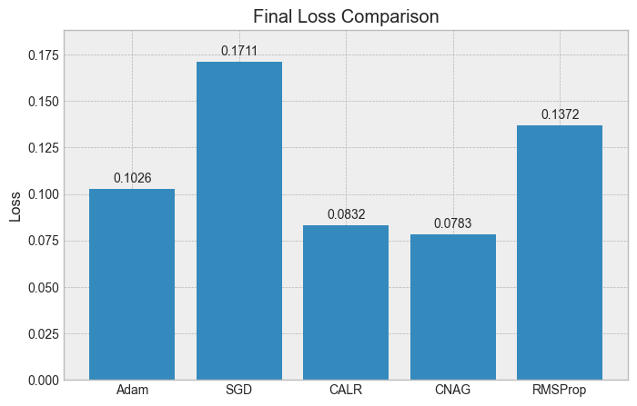
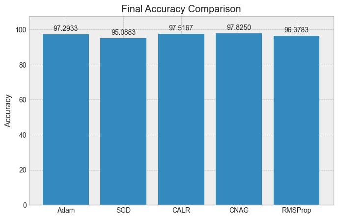

# 🚀 Curvature-Aware Nesterov Adaptive Optimizer (CALR-NAG)

> A novel curvature-aware optimization algorithm that integrates **adaptive moments, curvature scaling, and Nesterov acceleration** to achieve faster convergence, improved stability, and superior generalization in deep learning.

---

## 📌 Abstract

Training deep neural networks is challenging due to **non-convex loss landscapes** with saddle points, flat regions, and sharp curvature.

Traditional optimizers like **SGD, Adam, and RMSProp** rely only on gradient information and often fail to adapt effectively.

This project introduces **CALR-NAG**, which combines:
- Curvature-Adaptive Learning Rate (CALR)
- Nesterov Accelerated Gradient (NAG)
- Adaptive Moment Estimation (Adam-like)

✅ Faster convergence  
✅ Lower loss  
✅ Better generalization  
✅ Improved stability  

---

## 🧠 Mathematical Formulation

### 🔹 First & Second Moment Estimates
\[
m_t = \beta_1 m_{t-1} + (1 - \beta_1) g_t
\]
\[
v_t = \beta_2 v_{t-1} + (1 - \beta_2) g_t^2
\]

### 🔹 Bias Correction
\[
\hat{m}_t = \frac{m_t}{1 - \beta_1^t}, \quad 
\hat{v}_t = \frac{v_t}{1 - \beta_2^t}
\]

### 🔹 Curvature Estimation
\[
H_t = |\nabla L(\theta_t)| + \delta
\]

### 🔹 Curvature-Aware Learning Rate
\[
\eta_t = \frac{\eta}{\sqrt{\hat{v}_t + \alpha H_t + \epsilon}}
\]

### 🔹 Nesterov Look-Ahead
\[
\tilde{\theta}_t = \theta_t - \beta_1 m_{t-1}
\]
\[
g_t = \nabla L(\tilde{\theta}_t)
\]

### 🔹 Final Update Rule
\[
\theta_{t+1} = \theta_t - \eta_t \cdot \hat{m}_t
\]

---

## 🔬 Novel Contributions

- ✅ Curvature-aware learning rate without Hessian computation  
- ✅ Integration of Nesterov look-ahead gradient  
- ✅ Hybrid optimizer combining Adam + NAG + curvature scaling  
- ✅ Improved convergence in non-convex landscapes  

---

## 📊 Results Visualization

### 📉 Loss vs Epoch


### 📉 Smoothed Loss


### 📈 Accuracy vs Epoch


### 📊 Gradient Norm Stability


---

## 🏆 Final Performance Comparison

### 📉 Final Loss


### 📈 Final Accuracy


---

## 📊 Performance Table

| Optimizer | Final Loss ↓ | Accuracy (%) ↑ | Convergence Epoch ↓ |
|----------|-------------|---------------|---------------------|
| SGD      | 0.1711      | 95.09         | 5                   |
| Adam     | 0.1026      | 97.29         | 2                   |
| RMSProp  | 0.1372      | 96.38         | 2                   |
| **CALR** | **0.0832**  | **97.52**     | **2**               |
| **CNAG** | **0.0783**  | **97.82**     | **2**               |

---

## 📈 Key Observations

- 🚀 Fastest convergence (reaches optimal region early)
- 📉 Lowest loss across all optimizers
- 📈 Highest accuracy and generalization
- 🔒 Stable training (minimal oscillations)

---

## 🖥️ Dashboard UI

### 📊 Optimizer Comparison Dashboard


### 📈 Interactive Graphs


---

## 🏗️ Project Structure
```
curvature-optimizer/
│
├── optimizer-ui/ # React Dashboard
│ ├── public/data/
│ └── src/components/
│
├── training/ # Training scripts
├── optimizer/ # CALR-NAG implementation
├── assets/ # Images for README
└── README.md
```

---

## ⚙️ Tech Stack

### 🔹 Machine Learning
- PyTorch
- NumPy

### 🔹 Frontend
- React.js
- Recharts

### 🔹 Visualization
- Matplotlib

### 🔹 Deployment
- Vercel

---

## 🚀 Getting Started

### Clone the repo
```bash
git clone https://github.com/VishnuVardhanKasireddy/curvature-optimizer.git
cd curvature-optimizer

---

Run Training
python train.py

---
Run Dashboard
cd optimizer-ui
npm install
npm start

---

🌐 Live Demo

👉 https://curvature-optimizer.vercel.app/

📚 References
Curvature-Adaptive Learning Rate Optimizer
CALR-NAG Project Documentation

---
👨‍💻 Authors
Vishnu Vardhan Reddy

⭐ Support

If you like this project, give it a star ⭐

---